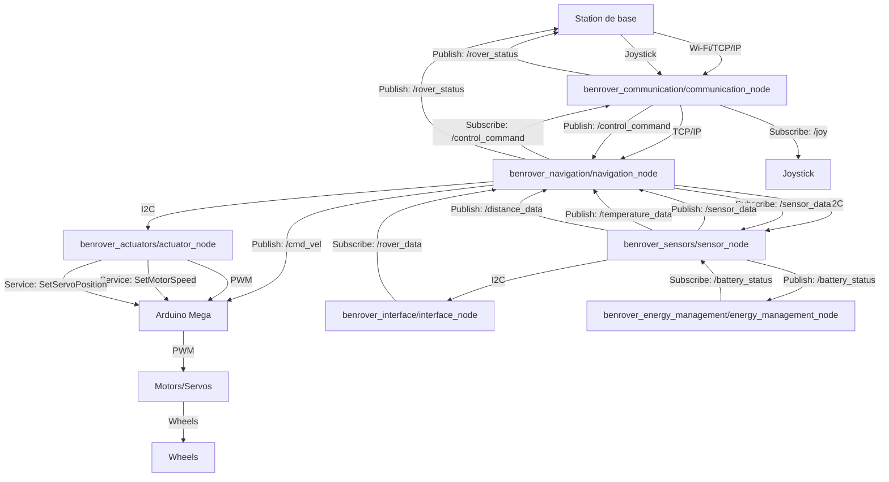

<Note>
  We have designed a ROS-based architecture for controlling and managing a rover. The system is distributed between a base station (computer) and the rover itself (Raspberry Pi), with additional components on an Arduino Mega.
</Note>

## System Architecture Diagram



## System Components

<CardGroup cols={1}>
  <Card title="Base Station" icon="desktop">
    - **Hardware**: Computer
    - **Main Node**: `benrover_communication/communication_node`
  </Card>
  <Card title="Rover" icon="robot">
    - **Hardware**: Raspberry Pi
    - **Main Nodes**:
      - `benrover_navigation/navigation_node`
      - `benrover_sensors/sensor_node`
      - `benrover_actuators/actuator_node`
      - `benrover_energy_management/energy_management_node`
      - `benrover_interface/interface_node`
  </Card>
  <Card title="Motor Control" icon="gears">
    - **Hardware**: Arduino Mega
  </Card>
</CardGroup>

## Node Descriptions

<Accordion title="Base Station Nodes">
  ### benrover_communication/communication_node
  - **Role**: Manages Wi-Fi communication between the rover and base station, and handles joystick control.
  - **Published Topics**:
    - `/rover_status`: Sends rover status information to the base station.
    - `/control_command`: Sends joystick movement commands to the navigation node.
  - **Subscribed Topics**:
    - `/joy`: Receives joystick data (position, buttons).
  - **Communication**:
    - Wi-Fi: Communicates with the navigation node on the Raspberry Pi.
    - TCP/IP: Used for communication with the navigation node.
</Accordion>

<Accordion title="Rover Nodes (Raspberry Pi)">
  ### benrover_navigation/navigation_node
  - **Role**: Manages real-time rover safety using LIDAR data for collision avoidance.
  - **Subscribed Topics**:
    - `/control_command`: Receives joystick movement commands.
    - `/sensor_data`: Receives LIDAR data.
  - **Published Topics**:
    - `/cmd_vel`: Sends modified speed commands for motors.
    - `/rover_status`: Sends rover status information.
  - **Communication**:
    - TCP/IP: Communicates with the base station.
    - I2C: Communicates with sensors on the Arduino Uno.

  ### benrover_sensors/sensor_node
  - **Role**: Retrieves and processes sensor data via I2C.
  - **Published Topics**:
    - `/sensor_data`: Sends sensor data (LIDAR) to the navigation node.
    - `/temperature_data`: Sends temperature sensor data (if applicable).
    - `/distance_data`: Sends distance sensor data (if applicable).
  - **Communication**:
    - I2C: Communicates with sensors.

  ### benrover_actuators/actuator_node
  - **Role**: Translates movement commands from the navigation node into motor and servo commands.
  - **Services**:
    - `SetMotorSpeed`: Modifies the speed of a specific motor.
    - `SetServoPosition`: Sets the position of a servo motor.
  - **Communication**:
    - PWM: Communicates with the Arduino Mega.

  ### benrover_energy_management/energy_management_node
  - **Role**: Monitors battery status and manages rover power consumption.
  - **Subscribed Topics**:
    - `/battery_status`: Receives battery status information from the sensor node.

  ### benrover_interface/interface_node
  - **Role**: Displays rover status information to the user (LCD screen or web interface).
  - **Subscribed Topics**:
    - `/rover_data`: Receives information to display from the navigation node or other nodes.
</Accordion>

<Accordion title="Arduino Mega Node">
  - **Role**: Receives motor speed commands (via PWM) from the actuator node on the Raspberry Pi and controls the rover's motors.
  - **Communication**:
    - PWM: Receives PWM signals from the actuator node.
</Accordion>

## Communication Flow

<CardGroup cols={2}>
  <Card title="Base Station to Rover" icon="laptop">
    Base Station ↔ Navigation Node (Raspberry Pi): Wi-Fi or TCP/IP
  </Card>
  <Card title="Internal Rover Communication" icon="robot">
    1. Navigation Node ↔ Sensor Node (Raspberry Pi): I2C
    2. Navigation Node ↔ Actuator Node (Raspberry Pi): I2C
    3. Actuator Node (Raspberry Pi) ↔ Arduino Mega: PWM
  </Card>
</CardGroup>

## Best Practices

<Note>
  Follow these best practices to ensure efficient implementation and debugging of the Benrover ROS architecture:
</Note>

1. **Message and Service Definitions**: Define clear ROS messages and services for each node and package to ensure efficient communication.
2. **Transformation System**: Utilize the `tf` package to manage reference frames for the robot and base station.
3. **Visualization**: Use `rviz` for visualizing the robot, sensors, obstacles, and environment maps.
4. **Debugging**: Employ `rosbag`, `rqt`, `rosnode`, and `rostopic` for identifying and fixing errors.

## Key Points

<CardGroup cols={2}>
  <Card title="Base Station">
    - Serves as the central server
    - Manages communication and user interface
    - Joystick is an input device
  </Card>
  <Card title="Rover">
    - Acts as a client
    - Connects to the base station
    - Receives commands and sends data
  </Card>
  <Card title="Communication">
    - Wi-Fi and TCP/IP between base station and rover
    - I2C between Raspberry Pi and sensors/actuators
    - PWM for motor and servo control
  </Card>
</CardGroup>

## Want to use our ROS workspace?

### 💻 Installation
1. Installing ROS by following the instructions in the documentation:
[https://docs.ros.org/en/humble/Installation/Ubuntu-Install-Debs.html](https://docs.ros.org/en/humble/Installation/Ubuntu-Install-Debs.html
)

2. Install ```colcon``` to build packages
    ```
    sudo apt install python3-colcon-common-extensions
    ``` 
3. Clone the repository
     ```
   git clone https://github.com/BenRover-24/rosws.git
   ```
### ⚙️ Configuring environment
- #### On Ubuntu
    If you don’t want to have to source the setup file every time you open a new shell, then you can add the command to your shell startup script:

    ```
    gedit ~/.bashrc
    ```
    In the file that opens, complete the following lines:
    ```
    source /opt/ros/humble/setup.bash
    source /usr/share/colcon_argcomplete/hook/colcon-argcomplete.bash
    source /path/to/the/root/of/your/workspace/source install/local_setup.bash
    ```

### Build the workspace
```
 colcon build --symlink-install
 ```
